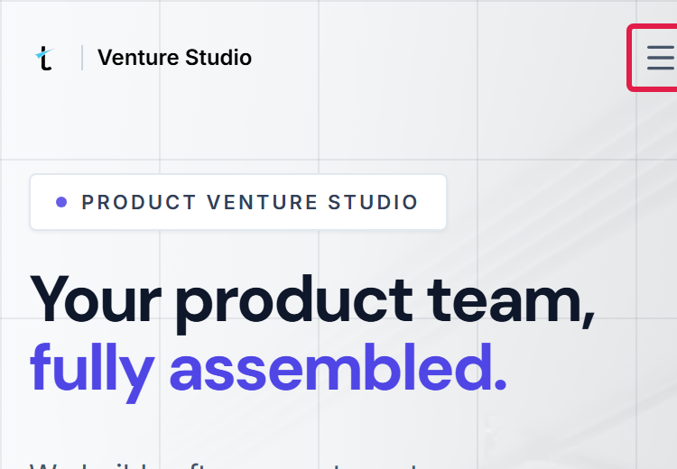
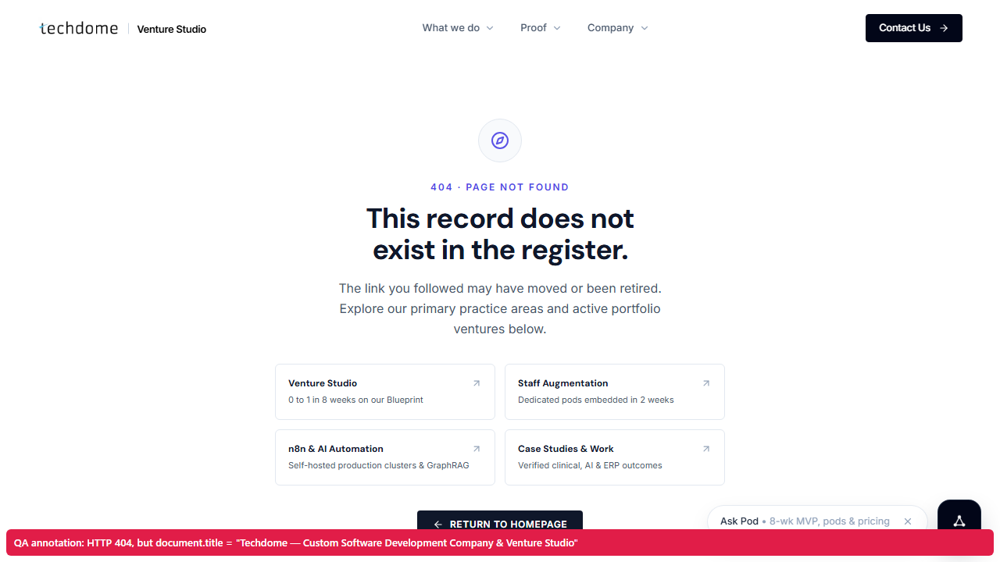
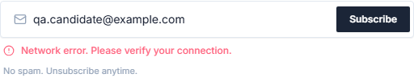
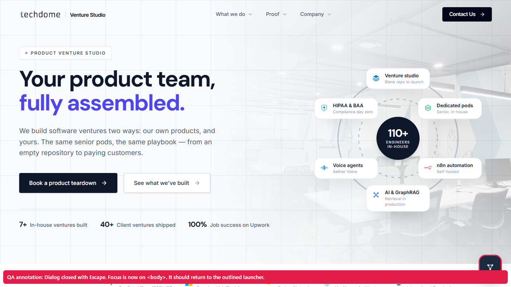
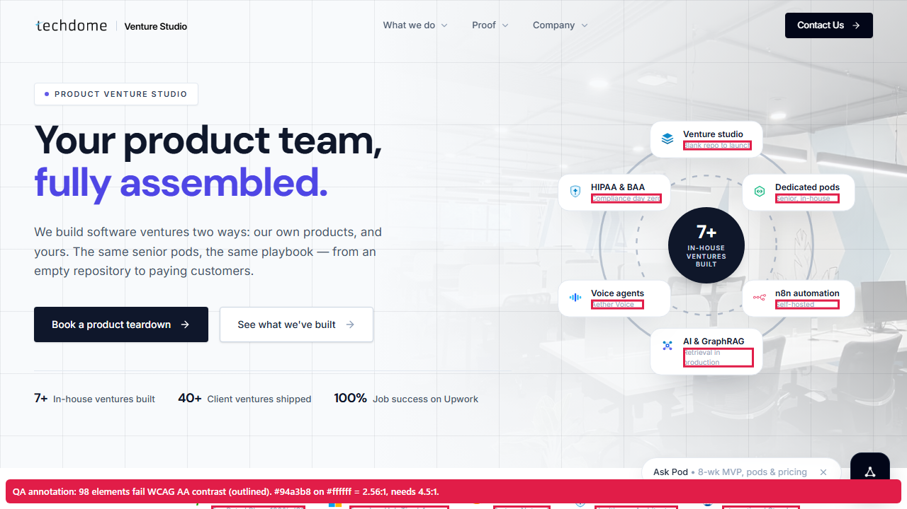

# Bug Report — techdome.io

Tested 2026-09-28/29 against production (`https://techdome.io`) with Chromium (Playwright 1.63): desktop 1280×720, plus 375×812, 768×1024 and 812×375 (phone landscape) emulation, axe-core 4.x for WCAG 2.1 AA, and CDP network throttling.

**14 findings: 0 Critical · 0 High · 5 Medium · 9 Low.** Nothing on the site is broken outright. Every conversion path (CTA → contact → Calendly, newsletter, chat) works. The findings cluster in mobile layout, accessibility and hardening, which is where a polished marketing site usually has gaps. Severities follow the assignment's definitions. I did not inflate any to "High" without a broken key feature to justify it.

Every bug with an automated test is tagged in code with `knownBug('BUG-00x')`. Run `npm run test:strict` to see them fail. Screenshots in `docs/evidence/` are regenerated by `npm run evidence` (anything red drawn on them is labelled "QA annotation"). Traces and JSON attachments are in `playwright-report/` after a run. The bug → test map is in `docs/traceability.md`.

| ID | Severity | Area | Summary | Automated |
|---|---|---|---|---|
| BUG-001 | Medium | Mobile layout | 4 pages overflow horizontally at 375 px (plus `/` at 768 px and in landscape); hamburger is clipped on phones | ✅ `mobile.spec.ts` |
| BUG-002 | Medium | Security | No `Content-Security-Policy` header on any page | ✅ `headers.spec.ts` |
| BUG-003 | Medium | Accessibility | Newsletter email input has no accessible name | ✅ `newsletter-form.spec.ts` |
| BUG-004 | Low | SEO | Product page `<title>`s are hard-truncated with a literal "..." | ✅ `navigation.spec.ts` |
| BUG-005 | Low | SEO / UX | 404 page reuses the homepage `<title>` | ✅ `navigation.spec.ts` |
| BUG-006 | Low | Security / API hygiene | Orphaned `/api/contact` endpoint accepts POSTs but no UI uses it | Manual |
| BUG-007 | Low | Forms | Newsletter client-side validation is only `email.includes("@")` | Manual (code review) |
| BUG-008 | Low | Navigation / IA | "Services Overview" (`/services`) is not in any header menu, desktop or mobile. It's footer-only | ✅ `navigation.spec.ts` |
| BUG-009 | Low | Forms / UX | A server outage is shown as "Network error. Please verify your connection." | ✅ `newsletter-form.spec.ts` |
| BUG-010 | Medium | Accessibility | Pod chat is `aria-modal` but doesn't trap focus, and Escape drops focus to `<body>` | ✅ `chat-widget.spec.ts` |
| BUG-011 | Medium | Accessibility | Site-wide low-contrast text: `#94a3b8` on white = 2.56:1 (needs 4.5:1), on all 6 pages scanned | ✅ `accessibility.spec.ts` |
| BUG-012 | Low | Performance | Optimised images (`/_next/image`) are cached for only 60 s (`must-revalidate`) | ✅ `performance-budget.spec.ts` |
| BUG-013 | Low | Accessibility | No "skip to content" link. The first Tab stop is the logo | ✅ `navigation.spec.ts` |
| BUG-014 | Low | SEO | 8 of 23 meta descriptions exceed ~160 chars and get truncated in search results | ✅ `seo.spec.ts` |

---

## BUG-001
**Severity:** Medium
**Summary:** Four pages are wider than a 375 px phone screen (`/` 401 px, `/products` 385 px, `/automation` 382 px, `/life-at-techdome` 382 px), so they scroll sideways. On `/` the "Open navigation" hamburger is pushed past the right edge and clipped. The homepage also overflows at 768 px (774 px) and in phone landscape, 812 px (818 px).
**Steps:**
1. Open DevTools → device toolbar → 375 × 812 (iPhone X/11/12 mini width)
2. Go to `https://techdome.io/`
3. In the console, run `document.documentElement.scrollWidth` → `401`. Or swipe left on a real phone: the page pans sideways
4. Look at the header's top-right corner: the hamburger is cut off
5. Repeat on `/products`, `/automation`, `/life-at-techdome`
**Expected:** `scrollWidth === 375` and the hamburger fully visible, as on the other 19 core pages (every one of the 23 is tested at 375 px).
**Actual:** 7–26 px of horizontal overflow on 4 pages. The leaf elements past the edge are the **fixed header wrapper** (`div.fixed.top-0.left-0`) and its `max-w-7xl` container, which stretch to the document width, and on `/` at 768 px a decorative background layer (`div.absolute.-inset-4.blueprint-grid`, whose negative inset pushes it past the edge). The hamburger's right edge is at ~385 px, so about 10 px of the primary mobile-navigation control is off-screen.



**Evidence:** screenshot above (`npm run evidence`). `tests/e2e/mobile.spec.ts` attaches `overflow-375_*.json` per page, listing each offending element and its right edge. "hamburger button is fully inside the viewport" reports the button's bounding box.
**Likely fix:** `overflow-x: clip` on `<body>` (safe with the fixed header), then fix the root cause: give `.blueprint-grid` a zero inset below `sm`, and find the wide element on the other three pages.
**Why Medium:** it degrades the primary mobile-navigation control on the most visited page, but nothing is fully blocked. The Product Hunt founder persona arrives on a phone.

---

## BUG-002
**Severity:** Medium
**Summary:** No `Content-Security-Policy` (or `-Report-Only`) header is sent on HTML responses.
**Steps:**
1. `curl -sI https://techdome.io/ | grep -i content-security` (same for `/contact`, `/newsletter`)
**Expected:** A CSP restricting at least `script-src` / `default-src` and `frame-ancestors`. The other modern headers are already set (HSTS preload, `X-Frame-Options`, `nosniff`, `Referrer-Policy`, `Permissions-Policy`), so this stands out as the one gap.
**Actual:** Header absent on all tested pages.
**Evidence:** `tests/security/headers.spec.ts` → "Content-Security-Policy is present" (3 pages). Full header dump:
```
strict-transport-security: max-age=63072000; includeSubDomains; preload
x-frame-options: SAMEORIGIN
x-content-type-options: nosniff
referrer-policy: strict-origin-when-cross-origin
permissions-policy: camera=(), microphone=(), geolocation=()
(no content-security-policy)
```
**Why Medium, not High:** no XSS vector was found (see US-018), so CSP is defence-in-depth here. It does matter more than usual on this site, though: it renders **LLM-generated output** (Pod chat) and loads GTM, which can inject arbitrary tags. A CSP is the backstop if either misbehaves.

---

## BUG-003
**Severity:** Medium
**Summary:** The newsletter email `<input>` has no `<label>`, `aria-label` or `aria-labelledby`. Its only "name" is the placeholder "Enter your email".
**Steps:**
1. Go to `https://techdome.io/newsletter` (the same component appears in the `/careers` footer)
2. Inspect the email input, or tab to it with a screen reader (NVDA / VoiceOver)
**Expected:** The field is announced as "Email address, edit text" or similar (WCAG 2.1 SC 1.3.1 and 4.1.2; SC 3.3.2 Labels or Instructions).
**Actual:** The input's only accessible name comes from the placeholder, which some screen readers ignore and which disappears once the user starts typing. (Verified from the DOM and Chromium's accessibility tree. Not yet confirmed with NVDA/VoiceOver by hand.) Playwright's `getByRole('textbox', { name: /email/i })` cannot find the field, which is why the page object has to fall back to `getByPlaceholder`.


**Evidence:** `tests/e2e/newsletter-form.spec.ts` → "email input has an accessible name" and "email input supports browser autofill" (no `name` or `autocomplete="email"` either, so mobile keyboards and password managers can't suggest the address). DOM:
```html
<input type="email" placeholder="Enter your email" required="" class="w-full pl-9 …" value="">
```
Compare the Pod chat input, which is labelled correctly (`aria-label="Message Pod"`).
**Why Medium:** the only native signup form on the site is unusable by name for assistive technology.

---

## BUG-004
**Severity:** Low
**Summary:** Product page `<title>`s are truncated mid-phrase with a literal ASCII "..." baked into the markup.
**Steps:**
1. `curl -s https://techdome.io/products/sparrow | grep -o '<title>[^<]*'`
**Expected:** A complete, intentionally short title (e.g. "Sparrow — Open-source API Testing Platform | Techdome"). If search engines need to truncate, they do it themselves.
**Actual:**
```
Sparrow — Open-source API testing, mocking ... | Techdome
JustInterview.ai — AI technical screening a... | Techdome
Saral Funding — Digital Loan Enablement & I... | Techdome
Geolytics — Advanced Data Analytics & BI So... | Techdome
Aether AI · Aether Voice — Conversational v... | Techdome
Catalyst — AI-powered industrial intelligen... | Techdome
Techdome ARC — Venture and engineering pod ... | Techdome
```
These show up as-is in browser tabs, bookmarks, and shared links. The truncation seems to be `description.slice(0, N) + '...'` applied to the title template.
**Evidence:** `tests/e2e/navigation.spec.ts` → "product page titles are not truncated with a literal ellipsis".

---

## BUG-005
**Severity:** Low
**Summary:** The 404 page correctly returns HTTP 404, but its `<title>` is the homepage title.
**Steps:**
1. Open `https://techdome.io/this-page-does-not-exist-qa`
2. Look at the browser tab title
**Expected:** "Page not found | Techdome" or similar.
**Actual:** "Techdome — Custom Software Development Company & Venture Studio". Browser history, analytics page-title reports and shared links can't tell a dead link from the homepage.


**Evidence:** `tests/e2e/navigation.spec.ts` → "404 page has its own title". (The status code check passes: "unknown URL returns a real 404". The page body itself, "404 · Page not found", is well designed.)

---

## BUG-006
**Severity:** Low *(needs triage by the owner)*
**Summary:** `POST /api/contact` is a live, unauthenticated endpoint that no page on the site uses.
**Steps:**
1. `curl -s -o /dev/null -w "%{http_code}" https://techdome.io/api/contact` → `405`
2. `curl -s -X POST -H 'Content-Type: application/json' -d '{}' https://techdome.io/api/contact` → `400 {"error":"Name and email are required fields."}`
3. Search the JS chunks loaded by `/`, `/contact`, `/newsletter` and `/careers` for `/api/`: they reference only `/api/newsletter/subscribe` and `/api/chat`. There is no reference to `/api/contact`, and no page has a name + email form
**Expected:** Dead endpoints are removed, or protected (rate limit / CAPTCHA / origin check) if something external still calls them.
**Actual:** The endpoint is live and validates input, so it presumably does something with valid submissions (sends an email, writes to a CRM). Since no UI calls it, nobody watches its traffic, and it could become an easy spam or email-relay path.
**Evidence:** curl output above. I deliberately did **not** send a valid or malicious submission, which would create a real lead or send a real email without the owner's consent.

---

## BUG-007
**Severity:** Low
**Summary:** Newsletter client-side validation is only `!email || !email.includes("@")`, so structurally invalid addresses make a server round-trip before being rejected.
**Steps:**
1. On `/newsletter`, enter `user@localhost` (passes native `type=email` *and* the JS check)
2. Submit
**Expected:** Obviously invalid addresses are caught instantly on the client.
**Actual:** A request goes to `/api/newsletter/subscribe`, which rejects it with 400 "Please enter a valid email address." The server validation is correct. This is a UX/latency and unnecessary-load issue, not data corruption.
**Evidence:** Client code in the `NewsletterSubscribeForm` chunk: `if(!p||!p.includes("@")){…}`. Covered by `newsletter-form.spec.ts` → "server-side rejection is surfaced to the user".

---

## BUG-008
**Severity:** Low
**Summary:** The "Services Overview" page (`/services`, title "Custom Software Development & Engineering Services") is linked only from the footer. The header's "What we do" menu, on both desktop and mobile, lists only the individual services.
**Steps:**
1. On desktop, open the header "What we do" menu. Items: Venture Studio, Staff Augmentation, n8n & AI Automation
2. At 375 px, open the hamburger. Its "What we do" group has the same three items
3. Scroll to the footer: "Services Overview" appears there
**Expected:** The hub page for the company's core offering is reachable from primary navigation. It is in the sitemap and is the natural landing page for a "what do you do?" visitor.
**Actual:** Only visitors who scroll to the footer can find it. On mobile the footer is a long scroll away.
**Evidence:** `tests/e2e/navigation.spec.ts` → '"Services Overview" is reachable from the header menu'. Accessibility snapshot of `#mobile-nav` in the mobile test's error context.
**How it was found:** my first mobile-menu test *passed* while clicking "Services Overview". The trace showed the click had landed on the footer link behind the menu overlay. Scoping the locator to `#mobile-nav` exposed that the menu never had the link. This is also a reminder that unscoped text locators can pass for the wrong reason.

---

## BUG-009
**Severity:** Low
**Summary:** When the subscribe API fails with a non-JSON error (a 500/502 page from the server, proxy or CDN), the form tells the visitor *"Network error. Please verify your connection."*, blaming them for Techdome's outage.
**Steps:**
1. Open `https://techdome.io/newsletter` with DevTools
2. In **Network → request blocking / overrides**, make `/api/newsletter/subscribe` return `500` with an HTML body (or use the mocked test)
3. Submit a valid email
**Expected:** A server-side message such as "Something went wrong on our side. Please try again in a minute."
**Actual:** "Network error. Please verify your connection." The client does `await res.json()` inside the same `try` as `fetch`, so any non-JSON body throws and falls into the offline branch. Users on a working connection will retry, reload or leave, and support gets told "your site says my internet is down".


**Evidence:** `newsletter-form.spec.ts` → "a server outage (500, HTML body) is not blamed on the user's connection". JSON 4xx/429 responses are handled correctly (separate passing tests), so this only affects real outages. That is also why it's Low: rare, but it hits exactly when things are already going wrong.

---

## BUG-010
**Severity:** Medium
**Summary:** The Pod chat declares `role="dialog" aria-modal="true"` but doesn't behave like a modal for keyboard users. Tab moves focus out of the open dialog into the page behind it, and closing with Escape leaves focus on `<body>` instead of returning it to the "Open Pod chat" launcher.
**Steps:**
1. On `https://techdome.io/`, Tab to "Open Pod chat" and press Enter (focus correctly moves into the message box)
2. Press Tab ~15 times: focus leaves the dialog and lands on page links hidden behind it
3. Press Escape to close, then press Tab once
**Expected:** (WCAG 2.4.3 Focus Order, and the ARIA Authoring Practices dialog pattern) Tab cycles inside the dialog while it's open, and on close focus returns to the launcher.
**Actual:** Focus escapes the modal. After Escape, `document.activeElement` is `<body>`, so a keyboard or screen-reader user is sent back to the top of the page. `aria-modal="true"` also tells screen readers to ignore everything outside the dialog, so while focus is outside it they are effectively on an unannounced page.


**Evidence:** `chat-widget.spec.ts` → "Escape closes the dialog and returns focus to the launcher" and "keyboard focus stays inside the modal while it is open". What works: focus moves in on open, Escape closes, Send is disabled for empty or whitespace input, and the 200-char limit holds.
**Why Medium:** the chat is a lead-capture channel, and for keyboard and screen-reader users it is disorienting to use.

---

## BUG-011
**Severity:** Medium
**Summary:** Secondary text in Tailwind `slate-400` (`#94a3b8`) on white has a contrast ratio of **2.56:1**. WCAG 2.1 AA requires 4.5:1 for normal text. axe-core flags it on all 6 pages scanned.
**Steps:**
1. Run axe DevTools (or `npx playwright test tests/e2e/accessibility.spec.ts`) on `/`
2. See the `color-contrast` violations, for example the hero card captions ("Blank repo to launch", "Compliance day zero"), stat labels and footer notes
**Expected:** ≥ 4.5:1 for body-size text (`slate-500` `#64748b` is 4.76:1 on white).
**Actual:** every scanned page fails. Counts come from scanning after scrolling the whole page, so scroll-animated content is included. Two runs:

| Page | Elements failing contrast |
|---|---|
| `/` | 89–103 |
| `/careers` | 45 |
| `/products/sparrow` | 41 |
| `/contact` | 11–21 |
| `/services` | 8–11 |
| `/newsletter` | 3–4 |

(An earlier scan taken before scrolling showed `/services` as clean. That was a measurement artefact: the failing text hadn't rendered yet.)



**Evidence:** `accessibility.spec.ts` attaches the full axe JSON per page. Apart from contrast, axe found **no other critical or serious WCAG 2.1 AA violations** on any scanned page (a hard-gated passing test).
**Why Medium:** it affects a lot of text across the site, including proof points buyers read. The fix is a single design-token change.

---

## BUG-012
**Severity:** Low
**Summary:** Next.js optimised images (`/_next/image?...`) are served with `Cache-Control: public, max-age=60, must-revalidate`, so browsers and the CDN re-validate every image after one minute.
**Steps:**
1. `curl -sI "https://techdome.io/_next/image?url=%2Ftechdome-logo-big.png&w=640&q=75" | grep -i cache-control`
**Expected:** Long-lived caching (days or more). Images are content-addressed by URL and quality.
**Actual:** `max-age=60, must-revalidate`. Images make up ~1.3 MB of the homepage's ~2.1 MB transfer, so returning visitors, including the load test's repeat navigations, pay for revalidation round-trips. By contrast, hashed JS/CSS under `/_next/static/` correctly uses `max-age=31536000, immutable` (passing test).
**Evidence:** `performance-budget.spec.ts` → "optimised images are cached for at least a day". Likely cause: the default `images.minimumCacheTTL` (60 s) in `next.config`.

---

## BUG-013
**Severity:** Low
**Summary:** No "skip to main content" link. The first Tab stop on every page is the logo, so keyboard users have to tab through the whole header (3 menus + Contact) on every page view.
**Steps:** Load any page and press Tab once.
**Expected:** (WCAG 2.4.1 Bypass Blocks) a skip link, visible on focus, targeting `<main>`.
**Actual:** Focus goes to "Techdome Venture Studio — home". The focus ring itself is clearly visible (2 px outline, a passing test), so the problem is only the missing bypass.
**Evidence:** `navigation.spec.ts` → 'a "skip to content" link is the first Tab stop'.

---

## BUG-014
**Severity:** Low
**Summary:** 8 of the 23 core pages have meta descriptions longer than ~160 characters, so Google truncates them mid-sentence in search results.
**Steps:** View source on the pages below and measure `<meta name="description">`.
**Actual:**

| Page | Length |
|---|---|
| `/studio` | 198 |
| `/services` | 188 |
| `/` | 185 |
| `/products` | 180 |
| `/contact` | 180 |
| `/about` | 175 |
| `/staff-augmentation` | 167 |
| `/life-at-techdome` | 162 |

**Expected:** ~150–160 characters, with the key message first.
**Evidence:** `seo.spec.ts` crawls all 23 pages and attaches `seo-crawl.json`. What passes: every page has a unique title and description, a self-referencing canonical and matching `og:url`, `lang="en"`, and exactly one `<h1>`, and every sitemap URL returns 200.

---

## Observations (not filed as bugs)

- **Early taps on the hamburger are ignored.** In one full run, a tap on "Open navigation" that happened right after the HTML arrived did nothing: the server-rendered button exists before React hydrates and attaches its click handler. On a slow phone, a visitor who taps immediately sees no response. It happened once in ~20 runs of that test, so it's logged as an observation. The test now retries the tap only while the menu is still closed (`BasePage.openMobileMenu()`).
- **JavaScript weight varies a lot between runs:** 292 KB in one full run and 662 KB in another (compressed, after a full scroll), depending on which lazy chunks the page pulls in. Total page weight is stable at ~2.1 MB (1.37 MB of it images) and is gated at 3 MB. JS isn't gated, since any threshold would be invented. It's recorded per run in the `page-weight` annotation, so the trend is visible in the published reports.

- **Page-weight / load time under concurrency.** Document response p95 is ~1.1 s with 5 users (well within budget). Full browser `load` event p95 was ~6.5 s in the same run (see `load-test-results.md`). Part of that is the test machine running 5 Chromium instances, but the homepage HTML alone is ~670 KB (inline RSC payload for 30+ case-study cards), which is heavy for mobile. Worth a Lighthouse pass.
- **LCP on `/work`** measured 2.2–2.7 s across lab runs, straddling Google's 2.5 s "good" line (`/` ≈ 1.6 s, `/contact` ≈ 1.3 s). It's borderline rather than a defect, so it's annotated per run, not failed.
- **Slow networks are handled well.** With Chromium's "Fast 3G" throttling, the hero `<h1>` was visible after ~4.0 s and the primary CTA after ~5.5 s.
- **Contact depends on a third party.** `/contact` has no first-party form. If Calendly is blocked (corporate firewall, ad-blocker, outage), the only path is the `mailto:` link. The fallback exists, so this is not a bug, but it's a single point of failure on the most important conversion page.
- **The chat error UI shows the raw server `error` string verbatim.** That's fine for today's messages, but it will surface any internal error text the API returns in future.
- **Server-side validation is solid.** Every malformed payload to `/api/newsletter/subscribe` and `/api/chat` returned a clean 400 JSON, never a 5xx.
